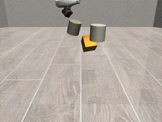
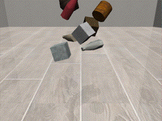
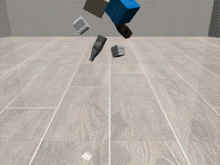
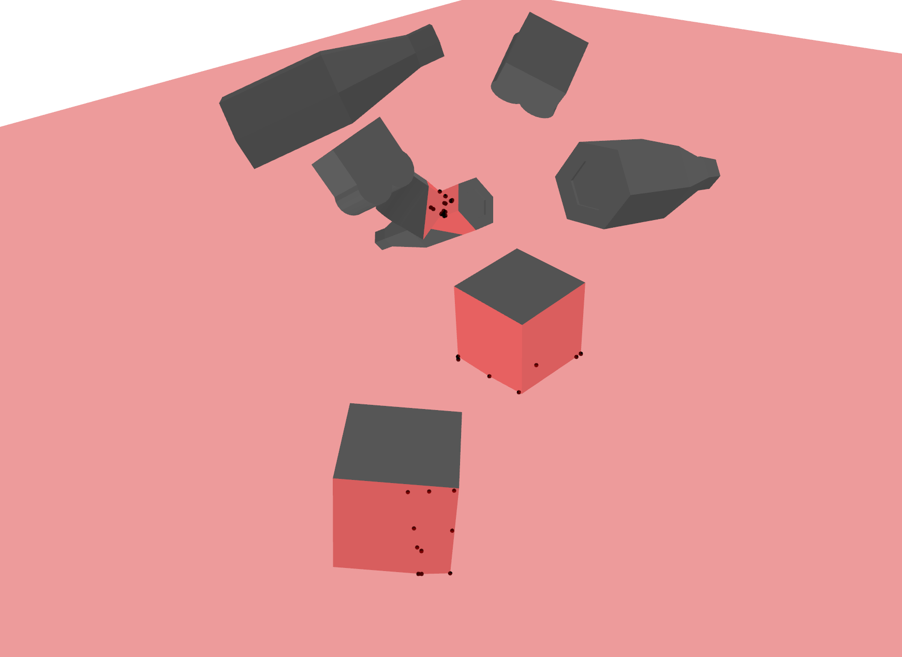
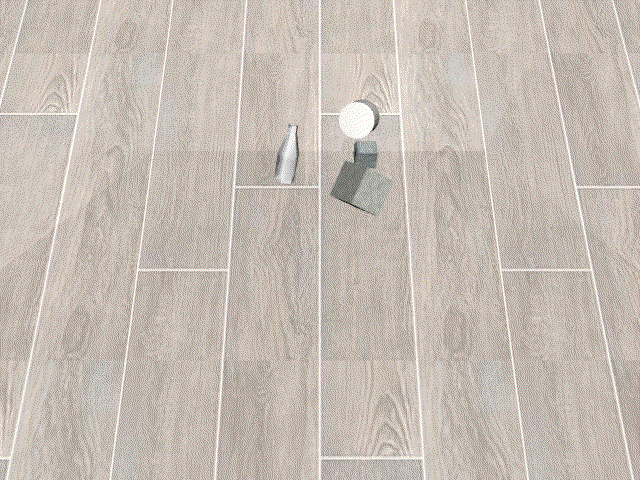
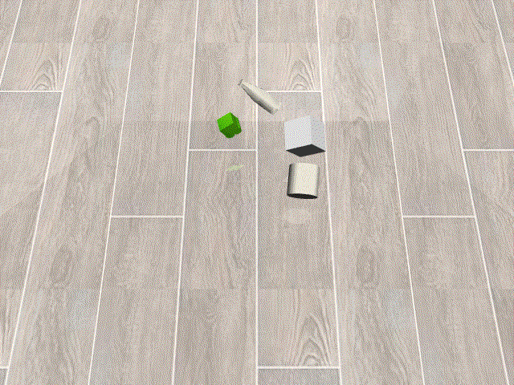
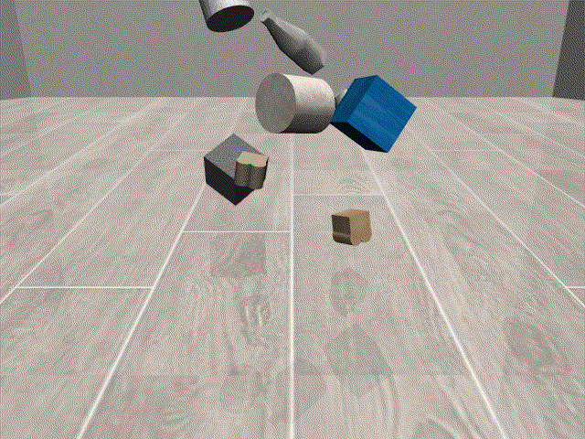
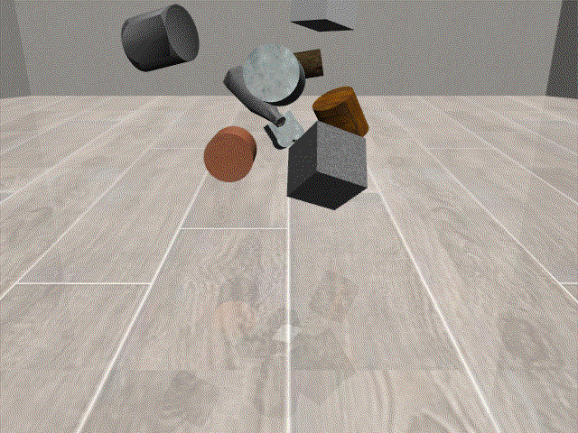
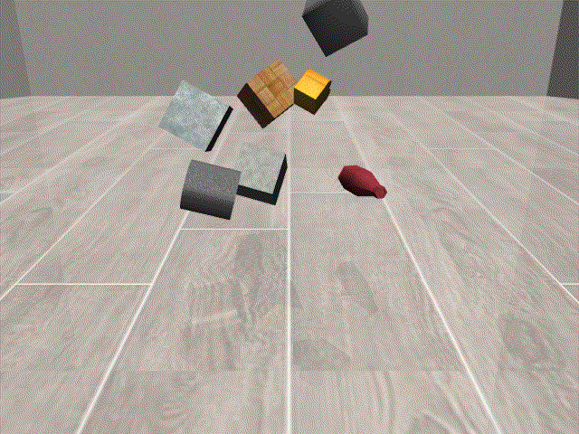

# FIGNet: Face Interaction Graph Networks for Simulating Rigid Body Dynamics

[](https://gist.github.com/cheerfulstoic/d107229326a01ff0f333a1d3476e068d)
[](LICENSE)
[](https://zenodo.org/doi/10.5281/zenodo.13763155)

**Version:** 0.0.1

**Date:** 2024-09-14

**Author:** Zongyao Yi

**Contact:** zongyao.yi@dfki.de

## Package overview

This repo is a **third party** implementation of the **FIGNet** [Learning Rigid Dynamics
with Face Interaction
Graph Networks](https://arxiv.org/pdf/2212.03574)\[1\], trying to reproduce the
results from the original paper. The package also includes the improvement
introduced in their following work (**FIGNet\***)\[2\].

This project is still in an early
experimental stage, and not guaranteed to produce the same results as in
the paper. Welcome to contribute if you find errors in the implementation.

### Major dependencies

- [Pytorch](https://pytorch.org/)
- [Pytorch3D](https://github.com/facebookresearch/pytorch3d)
- [hpp-fcl](https://github.com/humanoid-path-planner/hpp-fcl)
- [trimesh](https://trimesh.org)
- [mujoco](https://mujoco.org/)
- [robosuite](https://robosuite.ai/)

## Implementation details

### Dataset

The dataset is similar to the [Kubric MoviA
dataset](https://github.com/google-research/kubric) but with the
[Mujoco](https://mujoco.org/) as simulator and
[robosuite](https://github.com/ARISE-Initiative/robosuite/tree/master/robosuite/models/assets/objects/meshes)
objects.
For each episode, 5 to 10 objects are sampled. Their attributes are randomized,
including initial poses and velocities, as well as their static
properties such as mass, friction and restitution. Floor static properties are
also randomized.
The dataset contains 100k episodes of length 100 steps and 1M steps in total.
Each step in the dataset equals to 10 simulation steps. `dt` is calculated as
`dt=10*0.002` with `0.002` the step length in Mujoco.

<div align="center">
  
  
  
</div>

<details>
   <summary>Dataset format</summary>
The dataset is stored as a .npz file. Each trajectory contains a dictionary

```python
{
  "pos": (traj_len, n_obj, 3), # xyz
  "quat": (traj_len, n_obj, 4), # xyzw
  "obj_ids": {"obj_name": obj_id},
  "meta_data": {}, # describes the scene and properties of objects
  "mujoco_xml": str, # xml string to initialize mujoco simulation
}
```

</details>

### Node features

Node features: \[node velocities ((seq_len-1)*3),
inverse of mass (1), friction (3), restitution (1), object kinematic (1)\]

### Face-face edges

Collision detection is implemented by the
[hpp-fcl](https://github.com/humanoid-path-planner/hpp-fcl) library \[2\].
Face-face edge features are calculated based on the
detection results.

<div align="center">
  
</div>

### Graph structure and message passing

Because of the object-mesh edges and the novel face-face edges, the
graph consists of two sets of nodes (mesh and object nodes) and four sets of edges
(vert-vert, vert-object, object-vert, face-face). According to
following work of FIGNet \[2\], omitting
the mesh-mesh edges helps the model to scale without affecting the accuracy.
The implementation also adds the option to omit the mesh-mesh edges. Finally, the message passing layer
is augmented to handle face-face message passing.

Inspired by SDF-Sim \[4\], we
also add a new graph structure (referred to as **FIG+/FIG plus**
in the
implementation), where face-face edges are replaced by
vert-object edges, such that colliding vertices directly propagate information
to object nodes. Which graph structure to use is configurable.

## How to Install

### 1. Install Dependencies

Install opengl related libraries

```bash
apt update && apt install ffmpeg libsm6 libxext6  -y
apt install libglfw3 libglfw3-dev -y
```

Install PyTorch and torchvision

```bash
# adapt to your cuda version, this will install torch 2.4.0 with cuda 12.1 and torchvision 0.19.0
pip3 install torch torchvision --extra-index-url https://download.pytorch.org/whl/cu113
```

Install PyTorch3D following [install
instruction](https://github.com/facebookresearch/pytorch3d/blob/main/INSTALL.md)

```bash
pip install 'git+https://github.com/facebookresearch/pytorch3d.git@stable' -v
```

Install torch-scatter

```bash
# adapt to your cuda and python version, check https://data.pyg.org/whl
pip install https://data.pyg.org/whl/torch-2.4.0%2Bcu121/torch_scatter-2.1.2%2Bpt24cu121-cp38-cp38-linux_x86_64.whl
```

Install hpp-fcl. Since some features from hpp-fcl that we used here are not yet
released (see [issue
#590](https://github.com/humanoid-path-planner/hpp-fcl/issues/590)), this
library has to be installed from
[source](https://github.com/humanoid-path-planner/hpp-fcl.git) (commit [7e3f33b](https://github.com/humanoid-path-planner/hpp-fcl/commit/7e3f33b7614bba363ca6f27c2730539dfa20c3ea))
together with the latest [eigenpy
(v3.8.0)](https://github.com/stack-of-tasks/eigenpy.git) or install
the pre-built wheels for python3.8 as follows

```bash
# Install pre-compiled binary through pip if you are using python3.8, try upgrade your pip first

# pip install --upgrade pip

pip install https://cloud.dfki.de/owncloud/index.php/s/F9EwmwWkSW8pzfL/download/eigenpy-3.8.0-0-cp38-cp38-manylinux_2_31_x86_64.whl

pip install https://cloud.dfki.de/owncloud/index.php/s/Tb4baydBiRP6iN2/download/hpp_fcl-2.4.5-3-cp38-cp38-manylinux_2_31_x86_64.whl
```

### 2. Install other dependencies and fignet

```bash
git clone https://github.com/jongyaoY/fignet
cd fignet
pip install -r requirements.txt
pip install .

# Setup robosuite
python -m robosuite.scripts.setup_macros
```

## How to train

### 1. Generate dataset

```bash
python scripts/generate_data.py --ep_len=100 --internal_steps=10 --total_steps=1000000 --data_path=datasets  # Generate 1M steps for training
python scripts/generate_data.py --ep_len=100 --internal_steps=10 --total_steps=100000 --data_path=datasets # Generate 100k steps for validating
```

You can pre-compute the graphs from the raw dataset beforehand so that the training runs faster
(only the training dataset).

```bash
python scripts/preprocess_data.py --data_path=[path_to_dataset/train_dataset_name.npz] --num_workers=[default to 1] --config_file=config/train.yaml
```

This process takes around 8 hours with `num_workers=8`, and will create a
folder `path_to_dataset/train_dataset_name` with all
the pre-computed graphs stored inside. The dataset with 1M steps will create
960k graphs and takes around 335GB disk space (uncompressed). Alternatively, the pre-computed
graphs for training can also be downloaded
[here](https://cloud.dfki.de/owncloud/index.php/s/NgLbrWykYKcSabj). It needs to
be uncompressed after download.

### 2. Run the training

For the training you need to pass in a config file; a template can be found in
[config/train.yaml](config/train.yaml). Adapt `data_path`, `test_data_path` to
the train and test dataset respectively. For train dataset, it can be the raw
dataset (npz file) or the folder containing pre-computed graphs, while the test
dataset should be a npz file. Also adapt `batch_size` and `num_workers`
accordingly.

<details>
   <summary>Training config</summary>

```yaml
  # Training params
  use_cuda: true
  batch_size: 32
  num_workers: 8
  lr_init: 1.0e-3
  lr_decay_rate: 0.1
  lr_decay_steps: 1.0e+6
  training_steps: 1.0e+6
  warmup_steps: 1
  # Evaluation
  loss_report_step: 2000
  log_grad: True
  log_grad_step: 10000
  save_model_step: 2000
  eval_step: 2000
  rollout_steps: 50
  run_validate: true
  num_eval_rollout: 10
  save_video: true
  # Dataset
  data_path: "[path to dataset]"
  test_data_path: "[path to dataset]"
  # Simulator params
  simulator:
    collision_radius: 0.01
    input_seq_length: 3
    graph_builder:
      type: 'fig' # options are ['fig', 'fig_plus']
      noise_std: 3.0e-5
  # Logging
  logging_folder: "log"
  log_level: "info"
  # continue_log_from: "[log folder name]"
  # Resume training
  # model_file: "[path_to_model/models/weights_itr_22000.ckpt]"
  # train_state_file: "[path_to_model/models/train_state_itr_22000.ckpt]"
  # GNN params
  latent_dim: 128
  message_passing_steps: 10
  mlp_layers: 2
```

</details>

```bash
python scripts/train.py --config_file=config/train.yaml
```

### 3. Generate animation

The [render_model.py](scripts/render_model.py) script will sample several rollouts
with the learned simulator, and generate animation of the ground truth and
predicted trajectories.

```bash
python scripts/render_model.py --model_path=[model path] --num_ep=[number of episodes] --off_screen --video_path=[video path] --input_seq_len=3 --height=480 --width=640
# or if leave_out_mm is set true during training
python scripts/render_model.py --model_path=[model path] --leave_out_mm --num_ep=[number of episodes] --off_screen --video_path=[video path] --input_seq_len=3 --height=480 --width=640
```

## Results

The FIGNet model was trained for `1M` steps with batch size `128`, and FIGNet*
trained for `500K` steps with batch size `256`. However, the accuracy didn't improve significantly after
around `400K` steps.

### Accuracy

Comparing with the results from the papers \[1\]\[2\], the rotational errors are
slightly higher while the translational errors are about 2 times lower.
Presumably that's because the dataset being used here has smaller time step
`dt=0.02`, accounting for lower translational errors, and randomized object
properties (shape, size, friction, restitution) for higher rotational errors.

<div align="center">

|   |Rotational Error (rad)|Translational Error (m)|
|:--|:---:|:---:|
|FIGNet step 1M|0.34|0.04|
|FIGNet* step 500K|0.38|0.05|

</div>

### Rollouts

The following images show the qualitative comparison between ground truth and
model predictions of `100` steps:

<div align="center">
  <p style="text-align:center;">Ground Truth</p>

  
  
  

  <p style="text-align:center;">FIGNet</p>

  
  
  

  <p style="text-align:center;">FIGNet*</p>

  
  
  
</div>

### Model Weights

The weights can be downloaded here:

- [FIGNet_weights_itr_1M](https://cloud.dfki.de/owncloud/index.php/s/ErMJFWCFbDHiBrT)
- [FIGNet_weights_itr_750k](https://cloud.dfki.de/owncloud/index.php/s/gWDDJ6Hst2DJfra)
- [FIGNet_weights_itr_662k](https://cloud.dfki.de/owncloud/index.php/s/N5NyiZKFgrYz6iS)
- [FIGNet*_weights_itr_470k](https://cloud.dfki.de/owncloud/index.php/s/kMeZtTQ6HDGcS6p)
- [FIGNet*_weights_itr_500k](https://cloud.dfki.de/owncloud/index.php/s/oXrBcNHBLJD9fc5)

## Acknowledgments

### Code reference

The FIGNet implementation is highly inspired by the PyTorch version of Graph Network
Simulator and Mesh Graph Network Simulator:
[https://github.com/geoelements/gns](https://github.com/geoelements/gns). The
following files are direct copied from the
[gns](https://github.com/geoelements/gns) (MIT License):

- [normalization.py](fignet/normalization.py)

The following files are partially copied from
[gns](https://github.com/geoelements/gns):

- [graph_networks.py](fignet/graph_networks.py)
- [data_loader.py](fignet/data_loader.py)

### Funding

This work is carried out as part of the [ChargePal
project](https://www.dfki.de/en/web/research/projects-and-publications/project/chargepal)
through a grant of the German Federal Ministry for Economic Affairs and Climate
Action (BMWK) with the grant number 01ME19003D

## References

<a id="1">\[1\]</a> Allen, Kelsey R., et al. "Learning rigid dynamics with face
interaction graph networks." arXiv preprint arXiv:2212.03574 (2022).

<a id="2">\[2\]</a> Lopez-Guevara, Tatiana, et al. "Scaling Face Interaction
Graph Networks to Real World Scenes." arXiv preprint arXiv:2401.11985 (2024).

<a id="3">\[3\]</a> Pan, J., Chitta, S., Pan, J., Manocha, D., Mirabel, J.,
Carpentier, J., & Montaut, L. (2024).
HPP-FCL - An extension of the Flexible
Collision Library (Version 2.4.4) [Computer software].
[https://github.com/humanoid-path-planner/hpp-fcl](https://github.com/humanoid-path-planner/hpp-fcl)

<a id="4">\[4\]</a> Rubanova, Yulia, et al. "Learning rigid-body simulators
over implicit shapes for large-scale scenes and vision." arXiv preprint
arXiv:2405.14045 (2024).

## License

[MIT License](LICENSE)

## Known issues

### Preprocessing script with `num_workers > 0` raises following error

> RuntimeError: received 0 items of ancdata

Add the following line to [preprocess_data.py](scripts/preprocess_data.py)
should solve the problem (see [here](https://discuss.pytorch.org/t/runtimeerror-received-0-items-of-ancdata/4999/4)).

```python
torch.multiprocessing.set_sharing_strategy('file_system')
```
