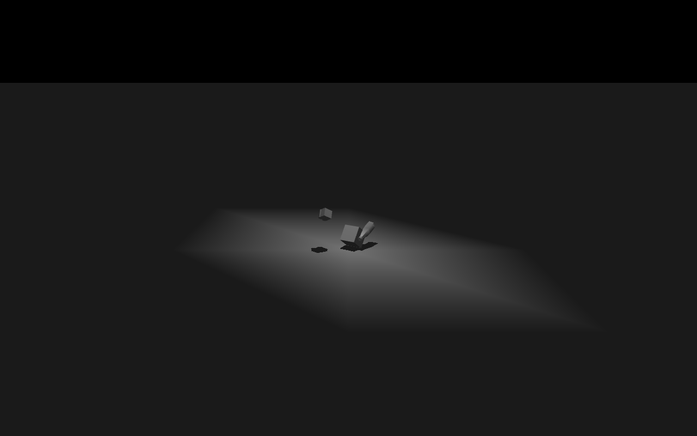

# FigNet: Face Interaction Graph Networks

[](https://gist.github.com/cheerfulstoic/d107229326a01ff0f333a1d3476e068d)
[](LICENSE)

**Version:** 0.0.1

**Date:** 2024-07-08

**Authors:** Zongyao Yi

**Contact:** zongyao.yi@dfki.de

## Package overview

This repo is a third party implementation of the paper [Learning Rigid Dynamics
with Face Interaction
Graph Networks](https://arxiv.org/pdf/2212.03574). We try to reproduce the
results from the original paper. The current version is still in an early
experimental stage.

## How to Install

```bash
git clone #TODO
cd FigNet
pip install -r requirements.txt
pip install .
```

## How to train

> Download dataset. We generated a dataset similar to the [Kubric MoviA
> dataset](https://github.com/google-research/kubric) but based on Mujoco and
> three simple meshes.

```bash
# TODO
```

> Run the training loop

```bash
python scripts/train.py # TODO
```

> Render rollout

```bash
python scripts/render.py # TODO
```

Generated rollout after training for 651k steps, with ground truth on top and
simulation on the bottom




## Acknowledgments

### Code reference

The FigNet package is highly inspired by the PyTorch version of Graph Network
Simulator and Mesh Graph Network Simulator:
[https://github.com/geoelements/gns](https://github.com/geoelements/gns). The
following files are direct copied from the [gns](https://github.com/geoelements/gns):

- [normalization.py](fignet/normalization.py)

The following files are partially copied from
[gns](https://github.com/geoelements/gns):

- [graph_networks.py](fignet/graph_networks.py)

### Funding

This work is carried out as part of the [ChargePal
project](https://www.dfki.de/en/web/research/projects-and-publications/project/chargepal)
through a grant of the German Federal Ministry for Economic Affairs and Climate
Action (BMWK) with the grant number 01ME19003D

## License

[MIT License](LICENSE)

## TODOs

### Publish code

- [x] License
- [ ] Install instructions
- [ ] Example usage
- [x] GIF showing the results
- [x] Acknowledgement

### Implementation

- [x] Simulator
  - [x] Node edge features
    - [x] boundary representation: using mesh
    - [x] normalization: "For all relative spatial feature vectors d, we also
      also concatenated their norm |d|"
  - [x] Interaction network
  - [x] Get rid of torch_geometric
  - [x] compute graph connectivity
  - [x] message passing
  - [ ] get rid of ref_sim
  - [x] encoder preprocessor
  - [x] decoder postprocessor
- [ ] unit test
  - [x] test_graph_networks
  - [x] test_trainer
    - [x] prepare small test dataset
- [ ] Logger
  - [ ] change log prefix
- [ ] Scene
  - [ ] Initialize scene in a nicer way
- [ ] DataLoader
  - [ ] data generation pipeline
  - [ ] Calculate connectivity and features beforehand and store them as dataset
  - [ ] Prepare data in batch mode
- [ ] Trainer
  - [ ] Resume training from check points
    as part of the input
- [x] Training
  - [x] training noise
  - [x] prepare data
  - [x] normalization: normalized all
    inputs and targets to zero-mean unit-variance.
    The loss is computed in the normalized space of the
    targets
  - [ ] upload dataset
- [x] Visualization
