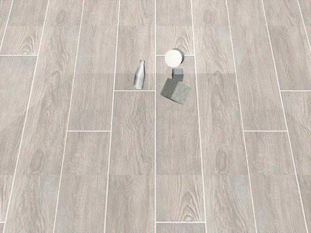
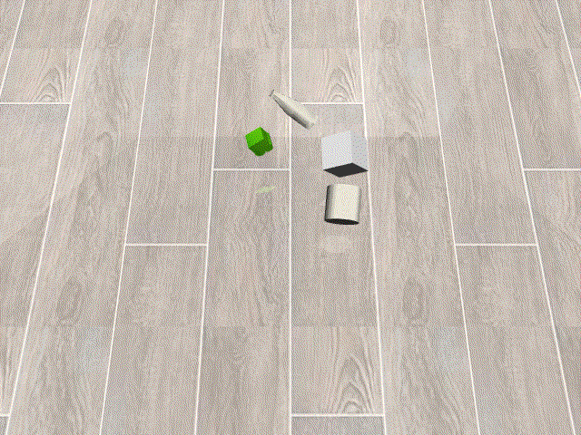
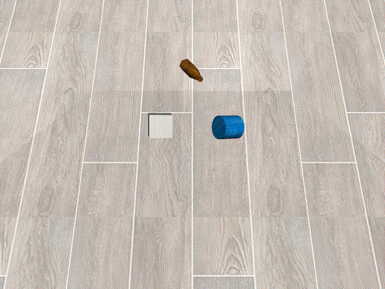
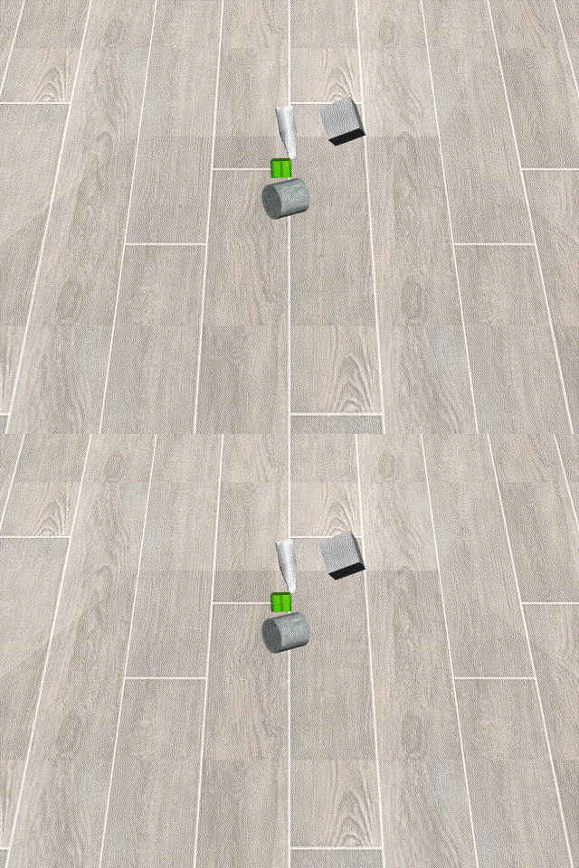
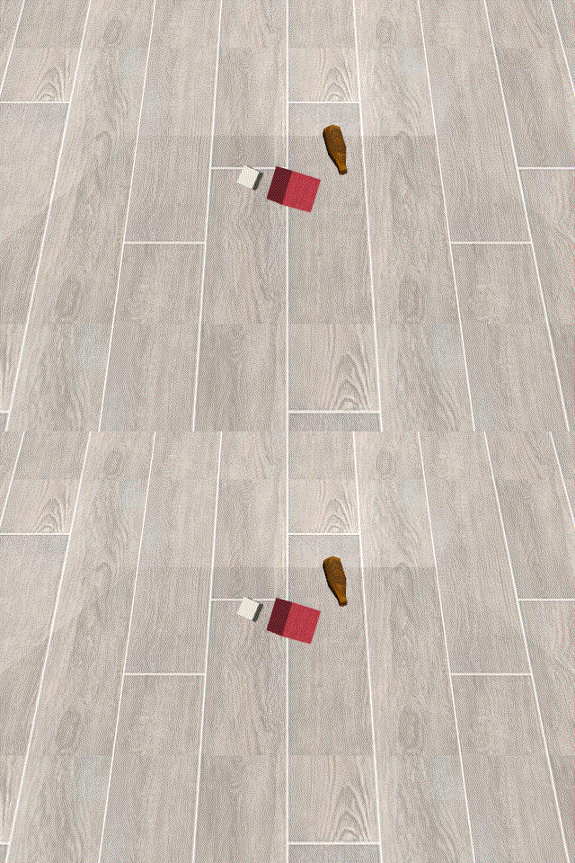
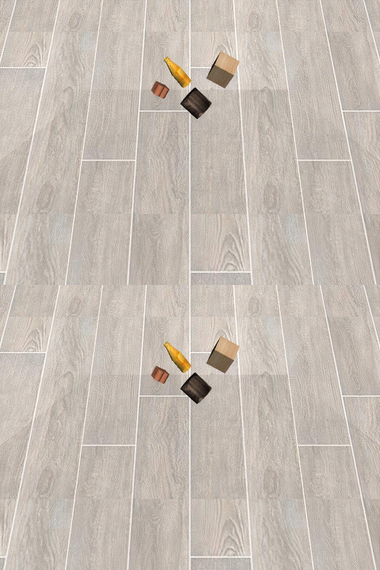

# FigNet: Face Interaction Graph Networks

[](https://gist.github.com/cheerfulstoic/d107229326a01ff0f333a1d3476e068d)
[](LICENSE)

**Version:** 0.0.1

**Date:** 2024-07-08

**Authors:** Zongyao Yi

**Contact:** zongyao.yi@dfki.de

## Package overview

This repo is a third party implementation of the paper [Learning Rigid Dynamics
with Face Interaction
Graph Networks](https://arxiv.org/pdf/2212.03574)\[1\]. We try to reproduce the
results from the original paper. The current version is still in an early
experimental stage.

### Dependencies

- [Pytorch](https://pytorch.org/)
- [Pytorch3D](https://github.com/facebookresearch/pytorch3d)
- [hpp-fcl](https://github.com/humanoid-path-planner/hpp-fcl)
- [trimesh](https://trimesh.org)
- [mujoco](https://mujoco.org/)
- [robosuite](https://robosuite.ai/)

## Implementation details

### Dataset

We generated a dataset similar to the [Kubric MoviA
dataset](https://github.com/google-research/kubric) with the [Mujoco
simulator](https://mujoco.org/) combined with
[robosuite](https://github.com/ARISE-Initiative/robosuite/tree/master/robosuite/models/assets/objects/meshes)
objects.
We randomized objects' initial poses and velocities, as well as their static
properties such as mass, friction and restitution. Floor static properties are
also randomized.
The dataset contains 50k episodes of length 200 steps and 1M steps in total.

<div align="center">
  
  
  
</div>

<details>
   <summary>Dataset format</summary>
The dataset is stored as a .npz file. Each trajectory contains a dictionary

```python
{
  "pos": (traj_len, n_obj, 3), # xyz
  "quat": (traj_len, n_obj, 4), # xyzw
  "obj_ids": {"obj_name": obj_id},
  "meta_data": {}, # describes the scene and properties of objects
  "mujoco_xml": str,
}
```

</details>

### Node features

For node features, we use: node velocities,
inverse of mass, friction, restitution, object kinematic

### Calculate face connectivity

We use the [hpp-fcl](https://github.com/humanoid-path-planner/hpp-fcl) library
to calculate face-face edges and features.

### Graph structure and message passing

Because of the object-mesh edges and the novel face-face edges, we build a
graph with two sets of nodes and three sets of edges. The message passing layer
is augmented to handle face-face messages

## How to Install

### 1. Install Dependencies

Install opengl related libraries

```bash
apt update && apt install ffmpeg libsm6 libxext6  -y
apt install libglfw3 libglfw3-dev -y
```

Install pytorch3d depending on your CUDA and python version as documented in
[install instruction](https://github.com/facebookresearch/pytorch3d/blob/main/INSTALL.md)

### 2. Install other dependencies and fignet

```bash
git clone https://github.com/jongyaoY/fignet
cd fignet
pip install -r requirements.txt
pip install .
```

## How to train

### 1. Generate dataset

```bash
python scripts/generate_dataset.py
--total_steps=1000000 --data_path=datasets  # For training
python scripts/generate_dataset.py
--total_steps=1000 --data_path=datasets # For testing
```

### 2. Run the training

```bash
python scripts/train.py --config_file=config/train.json
```

### 3. Render rollout

```bash
python scripts/render_model.py --model_path=[model path] --num_ep=[number of episodes] --off_screen --video_path=[video path]
```

After training for about 300k steps with batch size 32, we generated rollouts of 200 steps.
The rendered trajectories are shown below, with top row the ground truth and
bottom row the simulation.

<div align="center">
  
  
  
</div>

## Acknowledgments

### Code reference

The FigNet package is highly inspired by the PyTorch version of Graph Network
Simulator and Mesh Graph Network Simulator:
[https://github.com/geoelements/gns](https://github.com/geoelements/gns). The
following files are direct copied from the
[gns](https://github.com/geoelements/gns) (MIT License):

- [normalization.py](fignet/normalization.py)

The following files are partially copied from
[gns](https://github.com/geoelements/gns):

- [graph_networks.py](fignet/graph_networks.py)

### Funding

This work is carried out as part of the [ChargePal
project](https://www.dfki.de/en/web/research/projects-and-publications/project/chargepal)
through a grant of the German Federal Ministry for Economic Affairs and Climate
Action (BMWK) with the grant number 01ME19003D

## References

<a id="1">\[1\]</a> Allen, Kelsey R., et al. "Learning rigid dynamics with face
interaction graph networks." arXiv preprint arXiv:2212.03574 (2022).

## License

[MIT License](LICENSE)

## TODOs

### Implementation

- [ ] Logger

  - [ ] change log prefix

- [x] DataLoader

  - [x] data generation pipeline
  - [ ] Noise: only dynamic nodes?
  - [ ] Calculate connectivity and features beforehand and store them as dataset
  - [x] Prepare data in batch mode

- [x] Training
  - [ ] upload dataset
